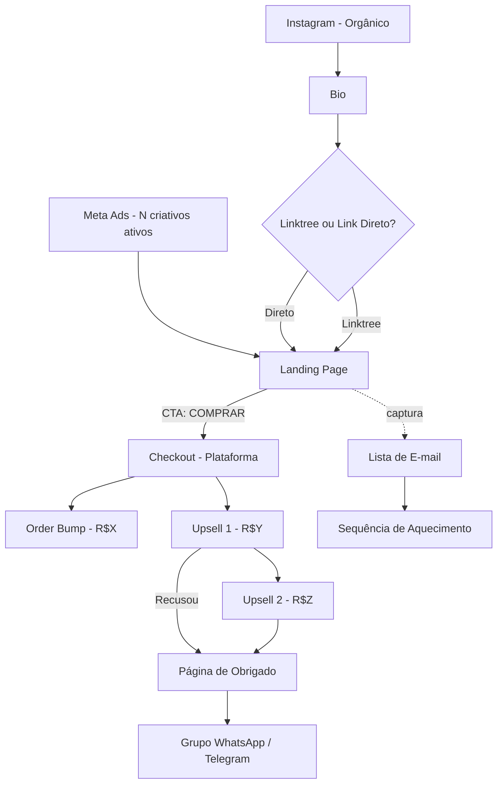

# Playbook do Espião de Funil

## 1. Taxonomia de funis (classifique sempre em UM)

| Tipo | Sinais | Ticket típico |
|---|---|---|
| **PLF (Product Launch Formula)** | Sequência de 3–4 vídeos, contagem regressiva, carrinho aberto/fechado em janela curta (5–7 dias), lista de espera | R$ 997–5.000 |
| **Perpétuo / Evergreen** | Anúncios rodando há +30 dias, contagem regressiva *fake* na landing, webinar automatizado | R$ 297–2.000 |
| **VSL pura** | Página com vídeo de venda longo (20–60min), sem CTA antes de X minutos, scroll bloqueado | R$ 197–1.997 |
| **Low-ticket / Tripwire** | Oferta abaixo de R$ 100, foco em volume, order bumps e upsells agressivos | R$ 9–97 |
| **High-ticket / Aplicação** | Sem preço na landing, formulário de aplicação, call de vendas, mentoria | R$ 5.000–50.000 |
| **Desafio / Challenge** | "Desafio de X dias", grupo no WhatsApp/Telegram, pitch no último dia | R$ 297–1.997 |
| **Webinar ao vivo** | Inscrição com data/hora, lembrete por WhatsApp, oferta só no final da live | R$ 497–2.997 |
| **Lançamento relâmpago** | 24–72h de carrinho aberto, sem evento prévio, urgência extrema | R$ 197–997 |

## 2. Sete gatilhos de copy (Cialdini + adaptações BR)

1. **Escassez** — "últimas vagas", "encerra hoje", contadores
2. **Urgência** — janela de tempo curta, bônus que somem
3. **Prova social** — depoimentos, prints, números ("+5.000 alunos")
4. **Autoridade** — credenciais, mídia, prêmios, formação
5. **Reciprocidade** — material gratuito antes da oferta (e-book, aula)
6. **Compromisso** — micro-sins ("clica aqui se você quer X"), desafio público
7. **Transformação** — antes/depois explícito, "de zero a X"

Anote sempre **quais** aparecem e **quantas vezes** cada um se repete na copy.

## 3. Checklist de pixels e rastreamento

Procurar no HTML da landing/checkout:

- [ ] `fbq(` → Meta Pixel
- [ ] `gtag(` ou `ga(` → Google Analytics / Ads
- [ ] `ttq.` ou `_tt_init` → TikTok Pixel
- [ ] `hj(` → Hotjar
- [ ] `_linkedin_partner_id` → LinkedIn Insight
- [ ] `pintrk(` → Pinterest
- [ ] `rdstation` ou `rdtrk` → RD Station
- [ ] `mautic` → Mautic
- [ ] Domínio em formulários: identifica plataforma de e-mail (ActiveCampaign, Mailchimp, ConvertKit, LeadLovers, etc.)

## 4. Plataformas brasileiras comuns

| Plataforma | Como identificar |
|---|---|
| Hotmart | URL `pay.hotmart.com`, `hotmart.com` |
| Eduzz | URL `sun.eduzz.com`, `chk.eduzz.com` |
| Kiwify | URL `pay.kiwify.com.br`, `kiwify.com.br` |
| PerfectPay | URL `go.perfectpay.com.br` |
| Monetizze | URL `app.monetizze.com.br` |
| Braip | URL `ev.braip.com` |
| Doppus | URL `pay.doppus.app` |

## 5. Template Mermaid (sempre `flowchart TD`)



Adapte: remova nodes que não existem, adicione os reais (webinar, VSL, desafio, etc).

## 6. Template do Relatório

Salve em `reports/<handle>-<YYYY-MM-DD>.md`:

```markdown
# Espionagem: @<handle>

**Data da análise:** YYYY-MM-DD
**URL analisada:** <url>

## Resumo executivo
- **Tipo de funil:** <classificação>
- **Ticket estimado:** <faixa>
- **Gatilho dominante:** <gatilho>
- **Estágio atual:** <aquecimento | carrinho aberto | evergreen | fechado>

## 1. Instagram
- **Seguidores:** <n>
- **Bio:** <texto da bio>
- **Link na bio:** <url>
- **Frequência de posts:** <n por semana>
- **CTAs recorrentes:** <lista>
- **Últimos posts relevantes:** <3–5 highlights com datas>

## 2. Landing page
- **URL:** <url>
- **Plataforma de checkout:** <Hotmart/Eduzz/etc.>
- **Headline:** "<texto>"
- **Sub-headline:** "<texto>"
- **Oferta principal:** <produto + preço>
- **Order bumps:** <lista>
- **Upsells detectados:** <lista>
- **Garantia:** <X dias>
- **Pixels ativos:** <lista>
- **Plataforma de e-mail:** <ActiveCampaign/RD/etc.>

## 3. Anúncios (Meta Ad Library)
- **Total de anúncios ativos:** <n>
- **Tipos:** <imagem X, vídeo Y, carrossel Z>
- **Mais antigo rodando desde:** <data>
- **Top 3 copies:**
  1. "<copy>"
  2. "<copy>"
  3. "<copy>"
- **Hipótese de criativo vencedor:** <qual + por quê>

## 4. Engenharia reversa do lançamento

### Linha do tempo identificada
<timeline em bullets>

### Gatilhos de copy detectados
- Escassez: <evidências>
- Urgência: <evidências>
- Prova social: <evidências>
- Autoridade: <evidências>
- Reciprocidade: <evidências>
- Transformação: <evidências>

### Estratégia inferida
<2–4 parágrafos explicando o que essa pessoa está fazendo, por quê funciona, e o que dá pra modelar>

## 5. Diagrama do funil

\`\`\`mermaid
<diagrama aqui — sempre com `click NODE href "URL" _blank` em LP, ADS, Checkouts, IGs, Typeform>
\`\`\`

🔗 **Link interativo do diagrama:** <link mermaid.live com pako encoded — gerar via Python no sandbox>

## 6. Diagnóstico estratégico

### 🎯 O que ele está fazendo (em uma frase)
<síntese da estratégia em 1 frase contundente>

### 🧠 Por que essa estratégia funciona
<4–6 parágrafos numerados, cada um explicando UM mecanismo psicológico/operacional que faz o funil converter. Cite gatilhos reais (Cialdini, AIDA, PAS), não genérico. Use evidências da espionagem.>

### 💪 Pontos fortes da operação
<tabela: # | Ponto | Impacto>

### ⚠️ Pontos fracos que ele poderia (e você pode) explorar
<tabela: # | Fraqueza | Como modelar/atacar>

### 🎬 Conclusão acionável
<3–5 parágrafos:
1. Resumo do "verdadeiro produto" sendo vendido (geralmente não é o que parece)
2. Lista numerada de 4–6 passos que o cliente pode copiar do funil
3. Cálculo de ROI conservador estimado da operação espionada (pra mostrar o tamanho do jogo)>

## 7. O que você pode copiar (modelar)
- <ponto 1>
- <ponto 2>
- <ponto 3>

## 8. Pontos fracos detectados
- <ponto 1>
- <ponto 2>

## 9. O que mudou desde a última espionagem (só se houver espionagem anterior do mesmo handle)
- **Tipo de funil:** <igual | mudou de X para Y>
- **Ticket:** <igual | mudou de X para Y>
- **Oferta principal:** <igual | mudou>
- **Anúncios ativos:** <N antes → N agora>
- **Novidades:** <lista curta>

---
*Relatório gerado pelo Espião de Funil v1.0*
```

## 7. Regras de qualidade

- Nunca escreva opinião como fato. Se não viu, marque `(não disponível)`.
- **Etiquete confiança:** `(confirmado)` pra dado direto da fonte (preço na landing, pixel encontrado no HTML), `(hipótese)` pra inferência sua (tipo de funil deduzido, criativo vencedor sem métrica de conversão real). O leitor precisa distinguir dado de dedução.
- Se a copy estiver em inglês/outro idioma, **traduza** as citações pro PT-BR no relatório.
- Cite trechos literais de copy entre aspas — não parafraseie a copy do alvo.
- Diagrama Mermaid: max 15 nodes, mantenha legível.
- Seção 9 (comparação temporal) só entra se existir espionagem anterior do mesmo handle — não invente linha de base.
